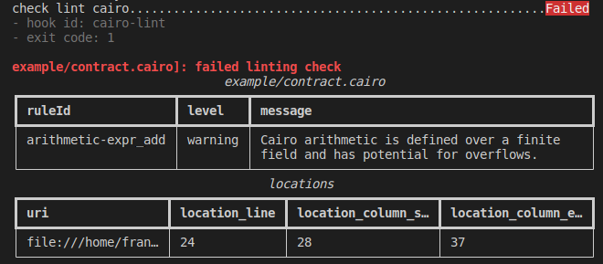

# pre-commit-cairo

[](https://github.com/franalgaba/pre-commit-cairo/actions/workflows/release.yml)

Cairo hooks for pre-commit. See [pre-commit](https://github.com/pre-commit/pre-commit) for more details

## Using pre-commit-cairo with pre-commit

Add this to your `.pre-commit-config.yaml`

```yaml
-   repo: https://github.com/franalgaba/pre-commit-cairo
    rev: main  # Use the ref you want to point at
    hooks:
    -   id: cairo-lint
    -   id: cairo-format
```

## Hooks available

### `cairo-lint`

Checks lint of Cairo contracts using [Amarna](https://github.com/crytic/amarna). If it fails a summary table with results is shown as shown below:



Amarna does not have a public release yet. So, to use this hook first you need to install Amarna in your project manually:

`pip install git+https://github.com/crytic/amarna.git@main`

or

`poetry add git+https://github.com/crytic/amarna.git@main`

After a public release for Amarna is made, the hook will install it automatically.

### `cairo-format`

Checks format of Cairo contracts using cairo-lang built in tool `cairo-format`. Command will be run with the `-i` flag.
